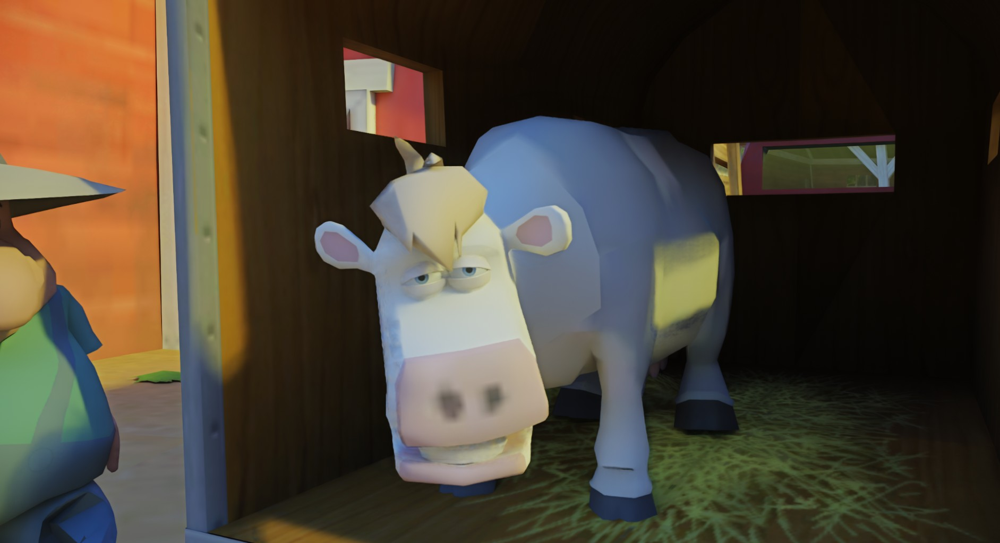

<h1 align="center">RTX Remix Compatibility Codebase</h1>

 

 

A Barnyard RTX-Remix compatibility mod for NVIDIA's [RTX Remix](https://github.com/NVIDIAGameWorks/rtx-remix).  

If you want to support my work,   
consider buying me a [Coffee](https://ko-fi.com/xoxor4d) or by becoming a [Patreon](https://patreon.com/xoxor4d)

Feel free to join the discord server: https://discord.gg/FMnfhpfZy9

 

#### It features:

- Fixed function rendering for world/skinned meshes
- Anti culling tweaks
- A basic ImGui menu (F4) for modifying settings and debugging purposes

The codebase includes [Ultimate ASI Loader](https://github.com/ThirteenAG/Ultimate-ASI-Loader/releases/tag/v9.7.0), which is used to load the Compatibility Mod itself.

 

## Installing
Grab the latest [Release](https://github.com/xoxor4d/barnyard-rtx/releases) and follow the instructions found there

 

## Compiling
- Clone the repository `git clone --recurse-submodules https://github.com/xoxor4d/barnyard-rtx.git`
- Optional: Setup a global path variable named `BARNYARD_ROOT` that points to your game folder
- Run `generate-buildfiles_vs22.bat` to generate VS project files
- Compile the mod

- Copy everything inside the `assets` folder into the game directory.  
  You may need to rename the Ultimate ASI Loader file if your game does not import `dinput8.dll`.

- If you did not setup the global path variable:  
  Move the `asi` file into a folder called `plugins` inside your game directory.

 

##  Credits
- [NVIDIA - RTX Remix](https://github.com/NVIDIAGameWorks/rtx-remix)
- [People of the showcase discord](https://discord.gg/j6sh7JD3v9) - especially the nvidia engineers ✌️
- [Dear ImGui](https://github.com/ocornut/imgui)
- [minhook](https://github.com/TsudaKageyu/minhook)
- [Toml11](https://github.com/ToruNiina/toml11)
- [Ultimate-ASI-Loader](https://github.com/ThirteenAG/Ultimate-ASI-Loader)

Lots of love to:
- [OpenBarnyard - InfiniteC0re](https://github.com/InfiniteC0re/OpenBarnyard)

 

And of course, all my fellow Ko-Fi and Patreon supporters  
and all the people that helped along the way!

